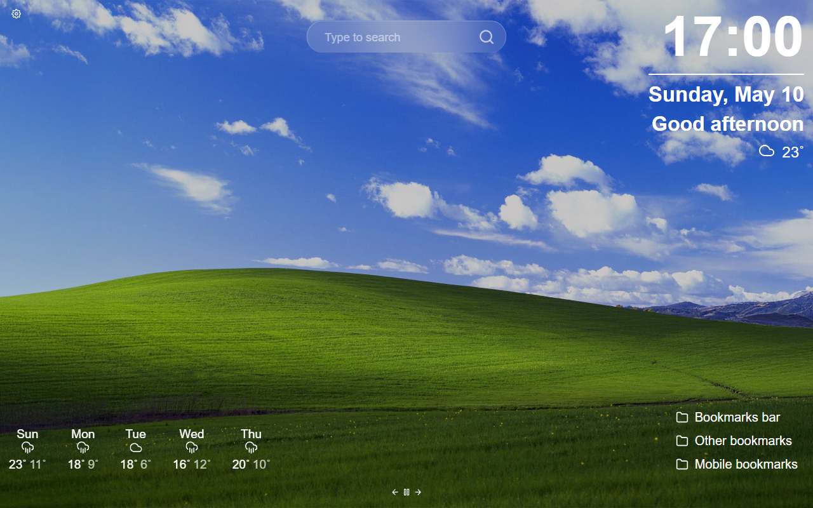
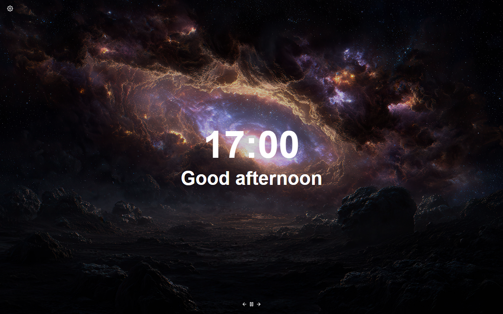

> A beautiful, customisable New Tab page for Firefox and Chrome.

 
 


<div align="center">
    <a href="https://chromewebstore.google.com/detail/tablissng/bfipcpdodajhkebldldfjdjlnbgfnkbi">
        </a>
    <a href="https://addons.mozilla.org/en-US/firefox/addon/wallpaper-alchemy-new-tab/">
        </a>
    <a href="https://www.gnu.org/licenses/gpl-3.0">
        </a>
</div>

## Brief Overview of a Few Improvements Over Tabliss

This list is by no means exhaustive. TablissNG includes many other tweaks, quality-of-life improvements, and features not detailed here.

- Customization
  - Support for custom search engines and browser defaults
  - Many more style options in display/font settings (eg. scale, underline, text outline, custom css class)

- Widgets
  - Time Tracker, Bitcoin Mempool, Top Sites, Binary Clock, Bookmarks, Custom HTML.
  - Enhancements: Daily Routine for Todos, Bible verses in Quotes, Markdown in Notes
  - "Free Move" mode for dragging widgets

- Backgrounds & Visuals
  - Wikimedia Image of the Day, NASA APOD, Giphy Image of the Day
  - Support for Videos, GIFs, and online image URLs
  - Automatic night dimming and random gradients

- Interface & Accessibility
  - Full dark mode
  - Complete translation support for all settings

## Installation

<a href="https://addons.mozilla.org/firefox/addon/wallpaper-alchemy-new-tab/"></a>
<a href="https://chromewebstore.google.com/detail/wallpaper-alchemy---new-t/bfipcpdodajhkebldldfjdjlnbgfnkbi"></a>

The extension is available in the [Firefox Add-ons Store](https://addons.mozilla.org/firefox/addon/wallpaper-alchemy-new-tab/), in the [Chrome Web Store](https://chromewebstore.google.com/detail/wallpaper-alchemy---new-t/bfipcpdodajhkebldldfjdjlnbgfnkbi). If you want to use Safari, see [INSTALL.md](INSTALL.md).

## Running Locally

For local development, you'll need Node.js and pnpm installed. Latest versions should work.

First, clone the repo:

```sh
git clone https://github.com/ArthurArakelyan/wallpaperalchemy-new-tab
cd wallpaperalchemy-new-tab
```

Then install the dependencies:

```sh
pnpm install
```

### Available Commands

- `pnpm run dev` — Start a local development server
- `pnpm run build` — Build the project
- `pnpm run test` — Run tests
- `pnpm run translations` — Extract and sync translation files (see [TRANSLATING.md](TRANSLATING.md) for details)
- `pnpm run translations status` — Show translation status (pass language, e.g. `pnpm run translations status fr`)
- `pnpm run translations create` — Create a new locale file (pass language, e.g. `pnpm run translations create de-AT`)
- `pnpm run translations migrate` — Migrate renamed translation keys (e.g. `pnpm run translations migrate --map old.id=new.id`)
- `pnpm run lint:fix` — Run ESLint with --fix (or just `pnpm run lint` for checking)
- `pnpm run prettier` — Run Prettier with --write (or `pnpm run prettier:check` for checking)
- `pnpm run deps:update` — Run interactive dependency update tool (or `pnpm run deps:check` to just check for updates and unused dependencies)

By default, build and dev will target the web version. To specify a platform (Chromium or Firefox), append `:chromium` or `:firefox` to the command. For example:

```sh
pnpm run dev:chromium
pnpm run build:firefox
```

<details>
  <summary>To test extension locally</summary>
  <br>
  <p>Find the extension in <code>dist</code> folder.</p>

  <p>For Chrome, go to <code>chrome://extensions</code>, turn on devoloper mode and click on "Load unpacked".</p>

  <p>For Firefox, go to <code>about:debugging#/runtime/this-firefox</code> and click on "Load Temporary Add-on".</p>
</details>
